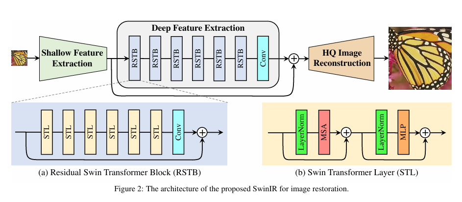
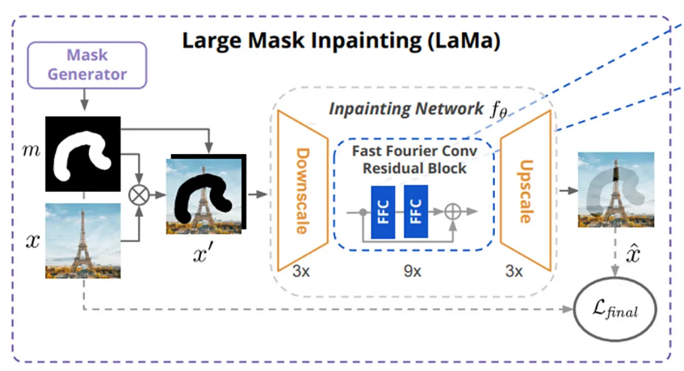
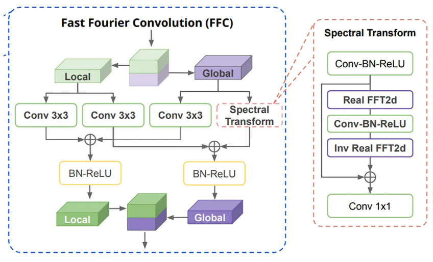
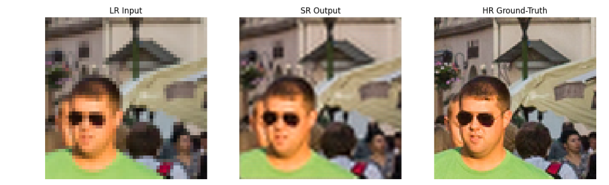
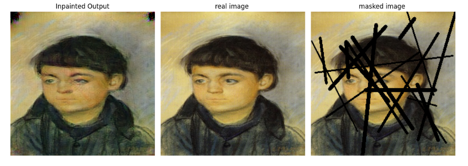
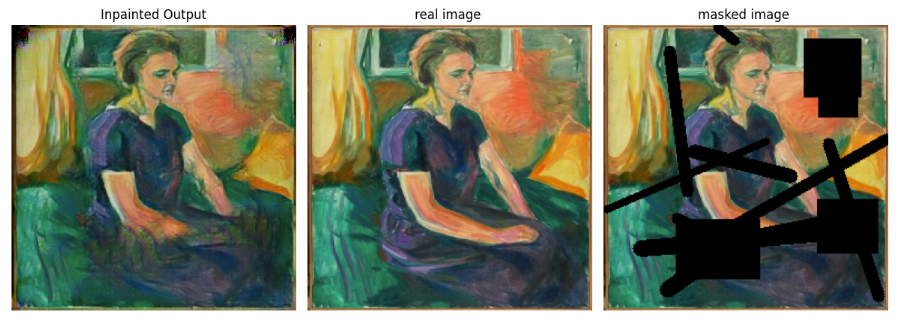

# Image Restoration — Super-Resolution & Inpainting
**Group Project — IIT Hyderabad**

 [Full Project Report](docs/Report.pdf) |  [Presentation Slides](docs/Presentation.pdf)


## Overview
This repository implements a deep-learning pipeline for **image restoration**, combining:

- **SwinIR** — Transformer-based **Super-Resolution**  
  
- **LaMa** — Large-Mask **Inpainting** with Fourier Convolutions  
   
  
- **Custom dataset preparation** and **mask generation** utilities

Target applications include restoring damaged artworks, repairing scanned documents, and filling missing or corrupted image regions.

---

## Tech Stack
- **Frameworks:** PyTorch, OpenCV, NumPy  
- **Models:** SwinIR, LaMa, PatchGAN  
- **Techniques:** Fourier Convolutions, Perceptual Loss (VGG), Adversarial Loss, Feature Matching  
- **Metrics:** PSNR, SSIM, FID, Inception Score (IS)

---

##  Features
- **Dataset Preparation**
  - Merge, analyze and standardize heterogeneous image sources.
  - Resize and prepare images to **256×256** for training pipelines.
- **Mask Generation**
  - Narrow masks (scratches), wide masks (large occlusions), box masks (rectangular), and free-form masks (DeepFill-style).
- **LaMa Inpainting**
  - Fourier Convolution-based inpainting handling large and irregular holes.
  - Combined loss: adversarial (PatchGAN), perceptual (VGG), discriminator feature matching, and gradient penalty.
- **SwinIR Super-Resolution**
  - Window-based multi-head self-attention with shifted windows.
  - Self-generated paired datasets for 256→512/1024 training.
  - Achieved **35.68 dB PSNR** on validation during experiments.

---


## Sample Results

| Task | Result |
|------|--------|
| Super-Resolution |  |
| Inpainting (narrow)|  |
| Inpainting (deepfillv2)|  |


> More visual results and comparisons available in the [Project Report](Report.pdf).

---

##  Quantitative Results

### SwinIR — Super-Resolution
| Metric | Value |
|--------|-------|
| Best PSNR | **35.68 dB** |
| Loss at Best PSNR | **0.0124** |

### LaMa — Inpainting (FID ↓ / IS ↑)
| Mask Type       | FID ↓  | IS (mean ± std) |
|-----------------|--------|-----------------|
| Large Wide Only | 132.45 | 2.55 ± 0.37     |
| All Combined    | 100.28 | 2.82 ± 0.55     |
| DeepFill Only   | 126.96 | 2.39 ± 0.26     |
| Narrow Only     | **83.10**  | **2.96 ± 0.40**  |

---


##  Installation

### Clone repository
```bash
git clone https://github.com/Kushwanthchitipotu/ImageRestoration.git
cd ImageRestoration
```

Using pip (recommended)
```bash
Copy code
python3 -m venv venv
source venv/bin/activate       # Windows: venv\Scripts\activate
pip install -r requirements.txt
```

If you prefer conda:

```bash
Copy code
conda env create -f environment.yml
conda activate <env-name>
```

## Usage
Open and run:

```bash

jupyter notebook notebooks/data-prep-swin.ipynb
```
This notebook merges image sources, analyzes dimensions and resizes images to 256×256.

2) Train / Run LaMa inpainting
Open and run:

```bash
jupyter notebook notebooks/lama_inpainting.ipynb
```
- Loads prepared dataset and masks
- Trains the LaMa inpainting model (or runs inference if checkpoints provided)
- Saves inpainted outputs to assets/ or results/

3) Train / Run SwinIR Super-Resolution
Open and run:

```bash
jupyter notebook notebooks/swin_ir_final.ipynb
```
- Generates HR images from LR inputs
- Trains / fine-tunes SwinIR
- Exports super-resolved images and evaluation metrics


## References
- Liang et al., SwinIR: Image Restoration Using Swin Transformer, 2021
- Suvorov et al., LaMa: Resolution-robust Large Mask Inpainting with Fourier Convolutions, 2021
- Liu et al., Partial Convolutions for Image Inpainting, ECCV 2018

---

## Acknowledgments

This project was completed as part of the course ComputerVisison(Ai3603) under the guidance of **Professor Sumohana Channappayya** at IIT Hyderabad. We thank them for their support and valuable feedback.

---

## Contributors
- **Manpurwar Ganesh** 
- **Tera Keshavardhan Reddy**   
- **K.D.V.S. Aditya**  
- **Ch. Kushwanth** 

---

## Contact

For questions or collaboration, feel free to reach out on GitHub:  
[github.com/Kushwanthchitipotu](https://github.com/Kushwanthchitipotu) /
[github.com/Aditya_Kudupudi](https://github.com/AdityaKudupudi11) /
[github.com/Manpurwar_Ganesh](https://github.com/ganesh1729m) /
[github.com/Keshavardhan](https://github.com/keshavardhan6124)

